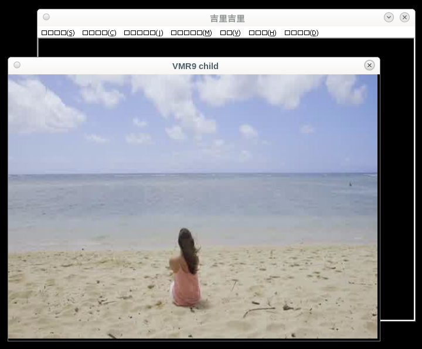
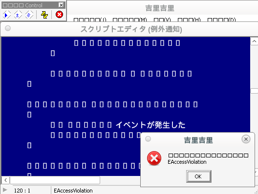
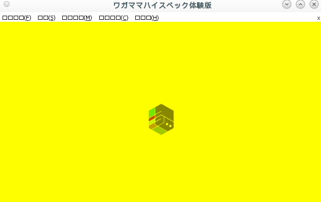

Making-of
=========

(This is a mostly accurate summary of what I did to create this thing. At least the latter parts are; the former are somewhat unchronological, since I only started writing this until I was a week into the project.)

Proton can, as of writing, not run certain Japanese visual novels properly; the videos fail to play. In some games, it just skips them; in some, the entire game crashes at that point.

With Steam's Windows 7/8 deadline looming, I need another way to run them. (No, Windows 10 doesn't count; I've heard too many scary stories about telemetry, forced updates, and otherwise disrespecting or ignoring the user's workflow.)

Googling it reveals some rumblings about the MPEG-1 video codec. It also reveals someone's put together a test VN, and even located the source code of Kirikiri, one of the most common Japanese VN engines (western VNs tend to prefer Ren'py). https://bugs.winehq.org/show_bug.cgi?id=9127#c102

MPEGs won't work, here's the source code of a BuildMPEGGraph function, let's just extract it to a separate project. Oh look, CLSID_CMpegVideoCodec isn't implemented in Wine. My googlings also revealed a quick and easy MPEG decoder, let's just hook it up. It's even split to demuxer / video decoder / audio decoder. https://github.com/phoboslab/pl_mpeg

The first roadblock
-------------------

(Spoiler: It's not the last one. The scrollbar size probably spoiled that already, anyways.)

Okay, I've got a half-finished DirectShow object with an input pin, let's connect it and see which functions it calls... ...why doesn't it connect to my pin?

Why does CLSID_MPEG1Splitter not have a video output pin?

Guess it makes sense; there is, after all, no input pin in Wine that can accept that media type. Let's just reimplement that object too.

...where did the sound go?

The second roadblock
--------------------

Wine's multimedia codecs are outsourced to GStreamer; the DirectShow filters are just wrappers. CLSID_CMpegAudioCodec creates an avdec_mp2float internally. Let's implement pl_mpeg in GStreamer too; I'll need it when/if Wine gains proper support for the MPEG objects. (Luckily, Wine looks up GStreamer elements by media type, not name, so I can just install mine and it'll work.)

How does GStreamer play an MPEG file? Let's pull up the log level, create a playbin element, and see what objects are inside...

...that's playbin, uridecodebin, filesrc, decodebin, typefind, mpegpsdemux, multiqueue, mpegvideoparse, mpegaudioparse, xvimagesink, avdec_mpeg2video, pulsesink, pulsesink, avdec_mp2float, input-selector, input-selector, tee, bin, queue, identity, videobalance, videoconvert, videoscale, bin, videoconvert, deinterlace, bin, queue, identity, volume, audioconvert, and audioresample. That's a lot.

I don't know what half of them are, but most of them seem irrelevant to me. Some additional experiments reveal that the necessary objects are

gst-launch-1.0 filesrc location=video.mpg ! mpegpsdemux name=demux ! mpegvideoparse ! avdec_mpeg2video ! queue ! autovideosink \
                                            demux. ! mpegaudioparse ! avdec_mp2float ! audioconvert ! queue ! autoaudiosink

What's this mpegaudioparse thing? It doesn't seem to do anything, it just takes bytes and returns the same bytes. Stacking multiple mpegaudioparse on each other does nothing. Maybe it adds media format information, for example sample rate?

Turns out MPEG-1, for some reason, contains two different levels of framing. The outer layer separates video and audio, and contains timing information - but inside that is another byte stream. A random packet from the outer layer is unusable as is - the decoder must first identify an inner packet boundary, and then parse the packets one at the time. That's what mpegaudioparse does - it takes the bytes, and returns the same, in differently-sized chunks.

Fortunately, MPEG-1 Audio Layer 2 framing is simple. Reading the pl_mpeg source code reveals the format, and writing my own parser and wiring it up to my demuxer is 50 lines of code.

I had some minor roadblocks with GStreamer segment formats too, but they too quickly fell.

Unfortunately, video parsing is a lot more complicated. Fortunately, my demuxer doesn't need to be connected to avdec_mpeg2video; it only needs to be connected to the matching pl_mpeg element, I don't need to match what Windows passes between the corresponding elements.

Now let's compile this thing as 32bit too, so it runs in Wine. Many of my VNs are 32bit, and while the Wine developers are working on running 32bit EXEs in 64bit Linux processes, that part is far from done. So I need gcc-multilib, and ... why is it complaining about C++ headers? Ah well, it's almost valid C already, might as well convert it the entire way. And ... obviously I need the GStreamer libraries, which means I need their pkg-config, which took a while to google (the top results say pkg-config accepts a --host argument, but it doesn't. Instead, --help reveals that the correct incantation is --personality=i386-linux-gnu.)

Let's try it in Proton too, via the CLSID_decodebin_parser object ...fails to load, can't find function gst_buffer_new_memdup. Ah well, that's easy to reimplement. Let's try again... wrong again, GStreamer version mismatch. Another easy fix, I don't need to report GST_VERSION_MAJOR and GST_VERSION_MINOR in GST_PLUGIN_DEFINE. And ... now it works.

Well, that's one problem less, let's go back to the Windows side and finish those DirectShow objects.

The third roadblock
-------------------

COM objects require a lot of boilerplate. I'd like to template it away. For example, there's a bunch of near-identical enumerator interfaces; I'd like to have one template that implements them all, templated only on the interface, and how to duplicate the return value (defaulting to AddRef). Something like

template<typename Tinterface, auto clone = []<typename Ti>(Ti* obj) { obj->AddRef(); return obj; }>  
class ComEnumerator {

Unfortunately, GCC is not quite pleased with that token soup, calling it an "internal compiler error".

One quick workaround (and a GCC bugzilla search that returned https://gcc.gnu.org/bugzilla/show_bug.cgi?id=105667) later, back to the DirectShow thing...

...so how do I fill in the AM_MEDIA_TYPE?

The fourth roadblock
--------------------

The filters can't connect unless they know the media type, including image size. The video decoder doesn't have the image size; it doesn't even have the byte stream.

Whatever, I'll just hardcode the video's size for now and worry about that later. Let's hope my recipient pin doesn't mind the YV12 pixel format.

...so how is the data supposed to flow? Isn't the graph manager supposed to handle that?

DirectShow data flow
--------------------

In GStreamer, the file source element pushes bytes to the sink as fast as the sink wants them. In DirectShow, the file source is just passive, the demuxer filter has to ask for bytes. I'm lazy, let's just read the entire thing into memory and not worry about it.

So now the filters are going from stopped to paused... ...why aren't they going to running?

Because data should flow through the filters even while paused.

But when do I submit those bytes? The filters won't go to running until I've submitted some bytes, but the graph's thread is currently busy waiting for that other filter to start. Do I need to create my own thread?

I don't like threading. It's powerful, but also dangerous. For IO-bound tasks like this, threads should not be used.

But that's not how DirectShow is designed; I need to create a thread. In fact, I need to create two - one for audio, one for video. I don't like any part of this. I don't always agree with the GNOME team's GUI designers, but their APIs are almost always good.

(In fact, it's even documented that I need to create threads. Naturally, I found that documentation only after wasting several hours reverse engineering what I'm supposed to do...)

Well, data is finally flowing, and my homemade recipient pin just dumps the video frames to disk, so I don't care about pixel format. Let's see if I can deal with the hardcoded video size...

...where is the 'change format' function?

DirectShow media format negotiation
-----------------------------------

There are a couple of available 'change format' functions, depending on how much of the format I want to change. https://learn.microsoft.com/en-us/windows/win32/directshow/dynamic-format-changes

Unfortunately, Wine's VMR-9 renderer doesn't support any of them. Back to the drawing board... which parts are immutable facts, and which are just incorrect assumptions? How does Windows solve that?

Trying to run my programs on a real Windows returns... several segfaults. I could debug it, but there are easier ways to figure out what it does. For example, I could simply check the documentation; the real MPEG demuxer uses the MPEG1VIDEOINFO format structure. Which contains size information. Three times.

Which means the demuxer must know the video size. Which means I must start up the pl_mpeg video decoder in the demuxer object. Ah well, this thing isn't intended to be upstreamed, it's fine if it's messy.

Well, that's the last piece. Let's rewrite some of Wine's registry keys so it picks my MPEG decoder objects, open this test VN, and enjoy the results.

Of course not
-------------

Nope, just the same black screen as before. Let's check the rest of Kirikiri's source code...

...wow, that's a lot of weird stuff. Let's start with these logging and exception handling functions, I want to see what they're called with. They're implemented in the .exe and called from a .dll, I can hijack them. Let's just swap out this function pointer.

Segfault, with an absurd stack trace. Of course. Why would anything ever be easy?

Detours and detours
-------------------

Let's disassemble that DLL.

Nope, the function remains as bytes. Let's take those bytes and send to my grab-bag of random utility functions (one of which is an x86 disassembler)...

Nope, 500 Internal Server Error. That is not the correct answer. Let's log in to the server and attach a debugger...

Nope, can't compile the debug-friendly build because a completely different module is throwing warnings about misleading indentation. Yes, that program sucks, but... sigh, let's just fix that. What is this programming detour chain phenomenon called? It feels like the kind of thing that should have a name.

Next up: Fails to compile because I'm passing wrong number of arguments to libbfd's init_disassemble_info. Must've changed during the Debian 12 upgrade. That's probably why it's crashing, too.

One fix later, and ... that worked. Can't have bad luck every time, I guess. The answer is ret 4; this program has set the default calling convention to stdcall. How entertaining. Well, that's easy to fix.

One detour less
---------------

...still segfaults. Note to self: If I hijack a 'get function address' function, swap in my own one, and keep the previous one around (for all those functions I don't want to implement myself), do not install that hijack twice, that'll just get recursive.

One fix later, and the logger says ... "krmovie : Use offscreen and YUV surface."; no exceptions, nothing else. That doesn't tell me what the problem is, but it does tell me a whole bunch of things about what it isn't.

Let's add some heavier logging... preferably by switching from hijacking memory addresses in DllGetClassObject to making a custom krmovie.dll that mostly delegates to the real one, but also adds whatever logging I want. It's easier, safer, and means I can inject my hijacks earlier.

I also need to hijack what functions the real krmovie imports, so I can add logging on that boundary too. Easiest way to do that is grab some code from a previous project. https://github.com/Alcaro/plungor

Let's start with replacing RegisterClassExA and CreateWindowA, and splitting out the VMR-9 window as a toplevel window, just to see what happens.

I know it needs to call IDirect3DDevice9::Present(). That is called when IMediaEvent::GetEvent() gives the expected value. Said expected value is sent to IVMRSurfaceAllocatorNotify9::NotifyEvent()... let's see how Wine implements that...

FIXME("(%p/%p)->(...) stub\n", iface, This); return E_NOTIMPL;

Well, that's clear enough. Finally solved this mystery, I'll hijack its VMR-9 and implement that function myself.

...wait, that function isn't even called. Why is that function not called?

One detour more
---------------

Is it because CVMRCustomAllocatorPresenter9::PresentImage (in Kirikiri) is returning D3DERR_INVALIDCALL? Which function is returning that? The easiest way to figure out that would be setting WINEDEBUG=d3d9+trace, but my Wine installation seems to have trace information compiled out. Fun.

The second easiest solution would be sticking a breakpoint on the call to that function and just stepping through it. Let's see how well gdb runs in Wine...

...not very. It can't set breakpoints on code that isn't loaded yet, which my DLL obviously isn't. But DebugBreak() works well enough.

And by 'well enough', I mean that trying to step over a call instruction, or out of the function, places the instruction pointer one byte too late. Ah well, easy enough to fix... would get annoying in long debug sessions, but in this case, it fails quite fast. It's in IDirect3DDevice9::SetRenderTarget, and checking with Wine's source code reveals that the chosen render target is placed on wrong device.

Why is it creating two devices, why is it keeping both around, and which of the two is wrong? How many missing Wine features am I running into? How close am I to the goal?

Does it have something to do with that second CreateWindow call I saw?

A fourth missing Wine feature
-----------------------------

Turns out Wine's VMR-9 doesn't implement IVMR9SurfaceAllocatorNotify::ChangeD3DDevice() properly. It's supposed to reinitialize the IVMRSurfaceAllocator9, but it doesn't, that'd be too easy.

It has an initialization function called when connecting the DirectShow pin... but that, of course, happened long ago. And it's not called directly, it goes via some internal helper object. I can't reach that function.

So... what if I do something really ugly? If I can't call that function, can I recreate it?

The VMR-9 object doesn't hold many Direct3D resources, just a few surfaces. And while Wine has infrastructure in place to use multiple surfaces, it's unused in practice; it just uses one.

And the pointer to that surface is passed out when connecting the DirectShow pin. What if... what if I just hold onto that pointer, and when the program asks to swap the Direct3D device, I swap it out?

One last detour
---------------

Surprisingly, it works. And patching up NotifyEvent() is easy too. It's finally presenting images.

Well, except that part where it isn't, of course. It is presenting the images, the Direct3D backbuffer has the right contents, but nothing shows up.

And this time, gdb can't help me; it gets stuck in absurd locations whenever I try to set a breakpoint. My guess is Kirikiri contains a catch block or five, and they confuse gdb.

Then let's go back to the oldest tricks in the book - shotgun and printf debugging. Let's just change things around at random. For example, let's put back the CreateWindow hijack (I removed it a while ago for no real reason).

...wow, that worked.

So, in conclusion...

- CLSID_CMpegVideoCodec needed to be implemented
- CLSID_MPEG1Splitter needed to be reimplemented
- CLSID_VideoMixingRenderer9 had at least two missing pieces, which needed to be patched over
- Something about Direct3D 9 does not work in child windows

The quest continues
-------------------

Getting it to show the video in a separate window is great progress, but I'm far from done. I still need to

- Investigate WMV/WMA support, and fix if necessary
- Implement it by replacing COM objects only, no custom krmovie.dll, so it can be installed into Wine and not into individual games; ideally also detect if the Wine bugs got patched, so my hijacks can hide themselves
- Get the same behavior as Windows, without a separate window
- Investigate shutdown behavior, I think there's some memory leaks and/or use-after-free
- Get it into Proton
- Investigate other VN engines; Kirikiri is the most common, but not the only one (though I suspect most of them suffer from the same bugs. Maybe they even copied code from each other.)
- Enjoy my hard-earned VNs

Let's start with the third one, it's the most reliant on my current testing framework. Once I start on the others, I'll probably dismantle most of it. Fourth should be done alongside second.

Extracting the relevant functionality into a separate program reveals that I can simply call IDirect3DDevice9::Present() with a different HWND, and it'll work.

Doing that in Kirikiri reveals that it does, in fact, not work. Because why would anything ever be easy?

How does that window differ from a normal parent window? How does it render?

I can't even find where in the source code the window is created, it refers to a bunch of functions that don't exist. Googling them points to some strange Delphi runtime support library; weird to call that from C++, but not the worst I've seen, I guess...

From what I can see, it doesn't import DirectDraw, OpenGL, nor any version of Direct3D (and Vulkan wasn't invented when it was created). Is it plain old GDI, is it drawing using some rare API I'm not familiar with, is it importing things in a way I don't recognize, or something else? It does import CreateDIBSection; the source code I have only shows that function in some bitmap overlay object, but that proves nothing, it could be in that mysterious Delphi runtime library.

The answer was obvious
----------------------

The window had a child window already. I did successfully draw on the parent window, but this extra child covered everything.

Obvious follow up question: What do I do with that information?

Do I delete the child window? Do I move it offscreen? Do I hide it? Do I remove WS_CLIPCHILDREN from the parent and hope the child window doesn't do anything unhelpful?

For testing, the easiest and safest solution is deleting it. In practice, I want the solution with the lowest risk of breaking if the Wine bug gets fixed, and in programs that use this object differently; this means it's better to remove WS_CLIPCHILDREN.

Either way, that's the third task done. Now that I know how, it's time to move that functionality into a custom VideoMixingRenderer9 and remove my fake krmovie.dll.

Naturally, this isn't smooth sailing either...

The two missing pieces in VideoMixingRenderer9 are easy and straightforward. But the hole in Direct3D is less easy; I am given access to the Direct3D device, and I can redirect the Present calls to another window - but which window? I'm never given one, and I can't extract it from the Direct3D device. There is a function to extract the focus window, if it exists, but nothing for the device window.

Heuristics
----------

I don't like heuristics. I'm a thoroughbred pessimist; I keep assuming the worst case. This makes me good at computer security and tricky optimizations (if I can convince myself it's safe and correct, it is), but it also means I'm skeptical to several forms of technology, including machine learning, VR, smart home, DRM, and heuristics.

But in this case, it doesn't seem like I have any choice.

I'll have to enumerate the program's windows, and check if there's exactly one visible. If yes, and this window has visible child windows, that's the target; if none, multiple, or no children, disable this functionality, to minimize the risk of breaking anything else.

A few glitches later, mostly caused by forgetting that the original PresentImage does more than just submit the swap chain, and it works.

Unfortunately, there's still trouble... in the original microkiri, clicking anywhere returns to the menu. With my custom objects, it gets stuck somewhere.

Some of it is because I screwed up the threading. This is easy to fix with some printf debugging.

Some of it is due to reference cycles and other refcounting accidents. I don't have good debugging tools for those, but the bad ones (shotgun debugging) worked well enough. (Some filters held references to secondary interfaces on the filter graph - filters are not allowed to reference the graph, that's a reference cycle.)

Some of it a segfault somewhere during shutdown. Or, well, whatever this is a symptom of.

(It was a segfault, I didn't expect JoinFilterGraph to be called with null arguments.)

And, of course, that wasn't the last shutdown issue... turns out the IVMRSurfaceAllocatorNotify9 interface has a separate refcount from the rest of the VMR-9. Wine even has a comment that Devil May Cry 3 demands it works that way; turns out DMC isn't the only one. I don't know if that's legal per COM rules, but those rules seem pretty poorly enforced anyways.

Naturally, that wasn't the last shutdown issue either... while the window is getting destroyed and memory is no longer leaking, the image still isn't showing up. Is this yet another Wine bug?

Even worse hacks
----------------

I don't feel like debugging that thing. Even if I can figure out what exactly it's doing, there's a good chance I can't hack over it properly.

Instead, let's go for an improper hack; these hacks are becoming worryingly large. Let's change the child window to a borderless popup window, owned by and positioned over the real one. This will screw up if the parent window is moved while the movie is playing, or if your window manager doesn't let me position windows the way I want, but this entire project is an awful hackjob anyways.

The first step is take one of my testbench programs and make it rearrange the windows, to see if it works.

Unsurprisingly, it does not. Changing the child to a toplevel window works, but that gives it an entry in the taskbar, and allows it to go below its parent.

Some additional guesswork reveals that if I add an extra ShowWindow(SW_HIDE) ShowWindow(SW_SHOW), it works. I should do that anyways, so it doesn't try to create then immediately destroy it as a proper toplevel.

Surprisingly, it works. After the obligatory fixes to move the window later (Kirikiri also moves the window, and doesn't know it's no longer a child window) and keeping the window in the top left corner of the screen while testing (a bug I've seen before, in the Heroes of Might and Magic III map editor), of course.

WMV
---

Now that the MPEG video works, it's time for next challenge - the WMV video. Connecting my debugger reveals a failed assertion, saying

Failed to call ConnectFilters( pWMSource, pWMVDec ). : [0x80004005] Error: 0x80004005

First step, copy enough of Kirikiri into my testing framework that I can reproduce the failure...

and it turns out it fails in CWMOutput::GetMediaType, becuase WMCreateSyncReader SetReadStreamSamples is incompletely implemented. It expects one of 15 named GUIDs (which is actually one of 13 because WMMEDIASUBTYPE_WMAudioV2/7/8 are identical - and I had to google up what value that GUID has, because my mingw headers don't have it), and KSDATAFORMAT_SUBTYPE_PCM is not one of those GUIDs. Which means that pin returns zero output formats, it has nothing to connect to the decoder pin, and the connection fails.

Next step: Figure out how to hijack that... unlike the previous objects, which were created by CoCreateInstance, this one is LoadLibrary("wmvcore.dll")->GetProcAddress("WMCreateSyncReader"). It's not internally implemented via CoCreateInstance either.

Luckily, the VMR9 is created before the WMV graph. So, how about, upon creation, that object... rewrites... krmovie's import table... and swaps out GetProcAddress... for a custom one that returns a homemade object that returns a compressed media type.........

Does the ugliness ever end
--------------------------

Oh, and Wine doesn't implement CLSID_CWMVDecMediaObject and CLSID_CWMADecMediaObject either. I'll have to either implement them properly, or just send uncompressed output from the SyncReader with a fake media type, and make the DMOs just swap the media type and nothing else. That latter part doesn't require anything too undocumented, it's just CoRegisterClassObject; hopefully nothing else in the process wants the real WMV decoders. Why does Kirikiri not just send decompressed output from the SyncReader directly to the VMR9, anyways?

So, first step is hijack krmovie's GetProcAddress... second step is hijack _rmovie.dll instead, krmovie.dll is a hacked wrapper module I made myself (the more places I have to inject debug logging and test code, the better)... yep, here's WMCreateSyncReader. And DecodePointer and EncodePointer, two of the Windows API's most useless functions (alongside SetRect and some of its friends)... sure, I'll just delegate that to the real GetProcAddress. This also gives me an opportunity to hijack Direct3DCreate9, but the only thing that'd give me is a slightly less hacky way to determine which child window is the render target; this thing works, it's good enough.

Filling in COM objects is boring, but straightforward. Swapping out the media type is also straightforward; when Kirikiri calls IWMMediaProps::GetMediaType, ask for 16 bytes more than the real media type struct, and place the real subtype GUID there. This augmented media type will then show up in IMediaObject::SetInputType, where I can recover the real one.

Just need to fill in IMediaObject functions in the order they're called, the rest can just return E_OUTOFMEMORY... GetStreamCount, AllocateStreamingResources (and FreeStreamingResources), SetInputType, GetOutputSizeInfo (just stub out the size for now), GetOutputType, SetOutputType, ProcessInput and ProcessOutput... need to fill in the timestamp too, but I can just copy that from ProcessInput, and, surprisingly...

...it works. Both video and sound are correct. Didn't even need to mess with the VMR9, what I did earlier is enough.

Segfaults on shutdown, though. And I need to dehardcode the output size. But it's a good start.

Fill in Flush(), fill in SetInputType(DMO_SET_TYPEF_CLEAR)... ...why is it crashing with error E06D7363? The opposite would make sense, it was reading a null pointer. What is E06D7363 even? Uncaught C++ exception? Who's throwing anything?

Is it this m_Surfaces.resize(*lpNumBuffers) call? What is *lpNumBuffers? That pointer is passed to AllocateSurfaceHelper, do I have anything injected there?

Turns out I do. And that function is, for some reason, changing *lpNumBuffers to zero, with a return value of D3DERR_INVALIDCALL. (For MPEG videos, which work, it returns ERROR_INVALID_PARAMETER, leaving the buffer count unchanged. Zero is a fine argument to std::vector<>::resize, but it works less well for the subsequent .at(0).)

Turns out said reason is the pixel format was D3DFMT_R8G8B8; should be D3DFMT_X8R8G8B8. And the 888 comes from MEDIASUBTYPE_RGB24.

Changing that is easy - but it still crashes, seemingly with a use-after-free. Probably something wrong with my VMR9 memory management... it has two different refcounts. Four if counting the ones in Wine's implementation. I think I'll need to redesign that...

...or just check how Kirikiri does it, sounds easier... looks like it doesn't keep any reference to the VMR9's IBaseFilter around, but it does keep an IVMRMixerBitmap9 around. If I implement that interface and steal its reference...

...no difference, of course, still crashes.

Let's see if I can convince this thing to emit a YUV format instead, I know YV12 works... the obvious one would be IWMMediaProps::SetMediaType, but that's a stub. The only function that sets output format seems to be IWMSyncReader::SetOutputProps.

Let's just call that... ...wow, it worked. Shutdown works fine too. Then let's keep that solution.

Which means...
--------------

The task is done. The videos work. Not perfectly (there's an off-by-2x2 on the window position, and the code is awful), but good enough for me.

Next up, there's plenty of debug prints and shitty formatting to clean up, but that's so boring it's barely worth mentioning.

Let's check my checklist from earlier...

- \[X] Investigate WMV/WMA support, and fix if necessary
- \[½] Implement it by replacing COM objects only, no custom krmovie.dll, so it can be installed into Wine and not into individual games; ideally also detect if the Wine bugs got patched, so my hijacks can hide themselves
- \[½] Get the same behavior as Windows, without a separate window
- \[X] Investigate shutdown behavior, I think there's some memory leaks and/or use-after-free
- \[ ] Get it into Proton
- \[ ] Investigate other VN engines; Kirikiri is the most common, but not the only one (though I suspect most of them suffer from the same bugs. Maybe they even copied code from each other.)
- \[ ] Enjoy my hard-earned VNs

Some of them are incompletely solved, but they're good enough.

Now let's try some random proper VN (for example Wagamama High Spec Trial Edition) and see what happens...

...OP movie works. It doesn't even show that off-by-2x2. It does glitch out, as expected, if I move the window, but I wasn't planning on doing that anyways; I prefer to play my VNs in fullscreen. (Testing them doesn't count as playing.)

The logo, however, does not, it's just black. And there are occasional Error Aborts if I skip the movie... whatever, I'll just not do that.

The logo is using my MPEG splitter, but there's no VMR9. Probably using one of krmovie's other three main entry points - microkiri uses only GetMixingVideoOverlayObject, but krmovie also exports GetVideoLayerObject and GetVideoOverlayObject.

The easiest way to track that down is to ask the MPEG decoder's proposed output pin what it is. It nicely responds that it's a Buffer Renderer, which is a Kirikiri thing that accepts only MEDIASUBTYPE_RGB32 and MEDIASUBTYPE_ARGB32 input; my MPEG decoder only implements MEDIASUBTYPE_YV12 output.

Well, that's fixable.

But, of course, not enough, it won't play the video. I don't feel like playing 20 Questions with what's breaking, so let's install my fake krmovie.dll into Wagamama and see where it fails.

Failed to query IAMStreamSelect. : [0x80004002] Error: 0x80004002. That's clear enough. Apparently the MPEG splitter needs that interface if the file has an audio channel. I thought this one didn't, but apparently it does, it's just empty. Good find, better find it now than after I think development is done.

Sure, let's fill that in. (Fun fact: Wine's CLSID_MPEG1Splitter doesn't implement it either.)

Segfault. Of course. Should've expected that.

At least this one is easy to track down. It's because of a VFW_E_NOT_COMMITTED in my IMemAllocator, which in turn is because committing returns VFW_E_SIZENOTSET, because I'm asking for a size of zero, because I'm using the bits per pixel value before setting it (it's only set when connecting the output pin, but the allocator is initialized when I connect the input).

Sure, let's initialize the allocator when connecting the output instead. And ... yep, here's an image. Just need to convert YV12 to xrgb8888. pl_mpeg has a function for that, just need to hook it in.

Close enough (I guessed wrong on plm_frame_to_rgba/bgra/argb/bgra). And apparently Kirikiri wants it upsidedown; sure, that's also easy to fix, plm_frame_to_x's stride argument is int, it can be negative. Many Windows functions accept right-side-up images by setting height negative, but Kirikiri doesn't seem to handle that properly, so upsidedown it is.

Well, that's the last issue on the Windows side, unless krmovie's GetVideoOverlayObject function does something weird. Now all that's left is the installer, the GStreamer-side codecs (spending all that time just to end up with protonmediaconverter is not an improvement), and releasing the thing.

Or if a Layer video is WMV; my hijack is installed when a VMR9 is created, but only Overlay videos use VMR9.

The only COM object that every code path creates is CLSID_FilterGraph, so I guess the best (least bad) solution is to hijack that... it's annoying, but straightforward. And since it's the first one created, I can make creating it register all the other objects, simplifying installation.

Proton
------

First (why am I using that word after 5000 words?), let's throw an mpeg into one of my test tools, then throw that into standard Proton and see what happens.

It fails to create CLSID_CMpegVideoCodec, then creates a CLSID_decodebin_parser that ends up with protonmediaconverter. As expected.

Now let's install krkrwine.

Actually, before that, let's create an installer. How does Proton look...

...like a giant mess, what a shocker... well, the task it's performing is also a giant mess, so it makes sense.

Based on Proton's architecture and my goals, I believe the best solution is copying the files to the main Proton installation, and adding a small snippet to user_settings.py that reinstalls krkrwine into this Proton prefix.

... Okay, installation works, and krkrwine's MPEG decoder works. Even the sound works, via Wine's builtin one, using mpg123audiodec. Now let's ask for decodebin... ...why is it getting stuck?

Why is it getting stuck if I run these GStreamer elements in Wine, but not in gst-launch?

Why does it run through the entire video before connecting?

Does it need the duration or something?

Seems that it does. Let's just hardcode five seconds because I don't care... well, that plays something. Prints a billion "gst_segment_to_running_time: assertion 'segment->format == format' failed", though. And cuts off the first second of audio.

Maybe I should try again with installing the Glorious-Eggroll codecs... they didn't help when the codecs weren't implemented on the Windows side, but that problem doesn't exist anymore.

Most of the GStreamer filters I need are in libgstlibav.so, which is present in Proton. But I guess ffmpeg isn't, so let's check what it tries to load that isn't present... that is libswresample.so.3, libavutil.so.56, libavformat.so.58, libavfilter.so.7 and libavcodec.so.58. Let's copy them and see what happens...

...nope, just protonmediaconverter. GST_DEBUG log says... Added plugin 'libav' plugin with 14 features from binary registry. That's probably wrong, it should've gained a few more... but probably not while it's cached in that registry thing. Let's just delete it. And then delete the correct registry... nope, still mediaconverter. Looks like it loads those libraries from some base Steam runtime. Then avdec_mpeg2video must be implemented somewhere else... what are those 14 features, anyways? Can I decode the registry?

GStreamer
---------

The registry format is undocumented other than GStreamer's source code, but that's good enough. The 14 features are avdeinterlace, avmux_flv, avdemux_gif, avdec_valve_h264, avdec_mjpeg, avdec_h264, avdec_gif, avdec_apng, avdec_pcm_vidc, avdec_pcm_lxf, avdec_mp3, avdec_flac, avdec_alac, and avdec_aac. I don't know why there are two h264 decoders, but too many isn't a problem; too few, like avdec_mpeg2video, is a problem.

Actually, I doubt that's the only missing one... I need the filters mpegpsdemux (from libgstmpegpsdemux.so), mpegvideoparse (libgstvideoparsersbad.so), avdec_mpeg2video (libgstlibav.so), mpegaudioparse (libgstaudioparsers.so), and avdec_mp2float (libgstlibav.so again).

mpegaudioparse exists, so I can ignore that. Let's try something easier - let's copy libgstvideoparsersbad.so and libgstmpegpsdemux.so, and see if they're compatible with this Proton... preferably to dist/lib64/gstreamer-1.0/, not dist/lib64/... yep, that got mpegpsdemux working.

Though mpegvideoparse complains about Failed to load plugin '/home/x1/steam/steamapps/common/Proton 8.0/dist/lib64/gstreamer-1.0/libgstvideoparsersbad.so': libgstcodecparsers-1.0.so.0: cannot open shared object file: No such file or directory. Sure, I can copy that file too.

Well, that's three of five necessary elements working. Next up, I need to figure out why libgstlibav won't register mpeg2video and mp2float... probably because av_codec_iterate() doesn't return them for some reason... can I inject a custom Linux program that calls that function?

Turns out I can, by adding os.system("LD_DEBUG=all LD_LIBRARY_PATH=/home/x1/steam/ubuntu12_64/video/ /home/x1/a.out") to user_settings.py. It says the list of codecs is h264_vaapi, apng, gif, h264, mjpeg, valve_h264, aac, alac, flac, mp3, vorbis, pcm_alaw, pcm_bluray, pcm_dvd, pcm_f16le, pcm_f24le, pcm_f32be, pcm_f32le, pcm_f64be, pcm_f64le, pcm_lxf, pcm_mulaw, pcm_s8, pcm_s8_planar, pcm_s16be, pcm_s16be_planar, pcm_s16le, pcm_s16le_planar, pcm_s24be, pcm_s24daud, pcm_s24le, pcm_s24le_planar, pcm_s32be, pcm_s32le, pcm_s32le_planar, pcm_s64be, pcm_s64le, pcm_u8, pcm_u16be, pcm_u16le, pcm_u24be, pcm_u24le, pcm_u32be, pcm_u32le, pcm_vidc, libvpx, libvpx-vp9; this is ... slightly fewer than it should be.

There's also a friendly avcodec_configuration() function, that returns, among others, --disable-all --enable-parser=h264 --enable-decoder='aac,h264,gif,vorbis,mp3,flac,alac,pcm*,valve*,apng,libvpx_vp8,libvpx_vp9' --enable-demuxer='aac,matroska,gif,ogg,mov,mp3,flac,wav,flv,apng' --disable-decoder='h263,hevc,mpeg1video,mpeg2video,vc1,vp8,vp9'

which is slightly less than I require.

Glorious Eggroll
----------------

Which means I need to copy in a better ffmpeg, probably from Glorious Eggroll.

And I need to find somewhere to install it to.

If I'm reading Proton's source code correctly, the first two entries of LD_LIBRARY_PATH - the two that are searched first - are ~/steam/ubuntu12_64/video and ~/steam/ubuntu12_32/video. Number three and four are ~/steam/steamapps/common/Proton 8.0/dist/lib64 and ~/steam/steamapps/common/Proton 8.0/dist/lib.

I don't want to overwrite any files, so I can't swap out the ones in ubuntu12_64. However, I can remove those directories from the search path from within user_settings.py; if I do that, I can copy an ffmpeg from Glorious Eggroll to dist/lib64, and it should work.

Right?

Of course not. Glorious Eggroll's ffmpeg doesn't have MPEG-1 either.

Though it does have a few more features; libgstlibav now offers the 19 features avdeinterlace, avdec_wmv3image, avdec_wmv3, avdec_wmv2, avdec_wmv1, avdec_vc1, avdec_msmpeg4, avdec_msmpeg4v2, avdec_msmpeg4v1, avdec_mpeg4, avdec_h264, avdec_h263, avdec_xma2, avdec_xma1, avdec_wmav2, avdec_wmav1, avdec_wmapro, avdec_wmalossless, avdec_aac.

Almost all of them are new, only avdec_h264 and avdec_aac remain. Even the mysterious avdec_valve_h264 is gone. But of the removed ones, only MP3 seems useful in Proton/Wine, and there's another MP3 decoder (mpg123audiodec). In a generic media player, removing FLAC and ALAC would be a loss, but if Glorious Eggroll excludes them, then Windows most likely excludes them too, so nobody's using them.

GStreamer again
---------------

Well, that solves some problems. I was hoping I could ditch my PL_MPEG module, but it doesn't seem so. At least I can get rid of the demuxer, I'm sure mpegpsdemux does a better job than me at estimating video length.

...oh, and I just realized that if the WMV decoder is connected to a Kirikiri Layer video object, the decoder will offer YV12, but Layer won't know what to do with that. I'll have to shuffle around the Wine-side format negotiation a bit. Let's put that on the todo list and forget it for now...

so I need to create a fake element that just creates another element, and forwards everything to there. How hard can it be?

Spoiler alert: Very. GStreamer does a lot of weird things I don't understand.

In fact, it does so many weird things I'm just going to give up. I'll leave the hard parts to GStreamer; I'll just create a decodebin and connect to its autoplug-sort signal.

Some annoying work later (seemingly partially caused by creating the pads too late), that works too.

That's one entry less on the todo list... all that's left is that WMV/Layer todo, and double checking everything in Proton. I suspect both will be easy. Just like the last ten times I thought it'd be easy.

Checking in Proton reveals ... nothing noteworthy whatsoever. Everything works as expected. It's nice to be wrong about being wrong sometimes.

Now for the WMV/Layer thing, should also be an easy change... ...nope, of course not.

One grueling debug session later, with MEDIASUBTYPE_YV12-formatted textures that are treated as RGB, reveal that Wine is checking the biCompression field, which I forgot updating. Half a minute to fix, three hours to discover, as usual... oh, and the crashes on shutdown are back.

Those crashes are easy to fix if I can get a stack trace. Wine has a builtin crash handler that prints stack traces (and a bunch of assorted garbage) - but Kirikiri has its own crash handler, which often takes precedence. And gdb is flaky in Wine.

But I guess gdb is worth a try.

It worked. Gave me a clean stack trace saying that the IMediaObject::SetOutputType format argument is null. DirectShow sure likes passing nulls to disconnect stuff... whatever, don't care, easiest solution is just returning E_POINTER aka 'uh dude why is that argument null? I don't want nulls'. It's not like Wine can do anything with that error.

And now that problem is gone.

Now to check Wagamama in fullscreen... flawless. (Well, it does stupid things with clamping the mouse position, but that's not video related. Worst case, I'll switch to windowed mode.)

Done
----

Only a few tiny things, and one less tiny, left to do.

- Check if I can remove libgstvideoparsersbad.so; I copied it when I thought I could acquire avdec_mpeg2video from Glorious Eggroll, but PL_MPEG has the mpegvideoparse element built in, so it shouldn't be necessary anymore.
- Check if I have any inappropriate debug code in user_settings.py that interferes with anything.
- Update the krkrwine installer to copy the GE ffmpeg and stuff.
- Test it in proper Proton.
- Release this crazy thing.
- Enjoy my hard-earned VNs.

Naturally, the final testing steps required for that give me a handful of trouble as well... partially due to a leftover remote/data_emergency.ksd save file created when this one VN crashed when I actually read it. And, of course, the mandatory portion of not working.

I think I'll have to go back a few steps and run microkiri in Proton... which, of course, is blocked by a pressure-vessel-locale-gen: Unable to find ja_JP in /etc/locale.gen /usr/share/i18n/SUPPORTED Assuming UTF-8 and hoping that works...

Can be fixed with a quick `import __main__; __main__.g_session.env["LC_ALL"] = "ja_JP"` in user_settings.py, but... sigh. So many roadblocks.

Doesn't work here either, of course.

Let's go back another step, to the standalone video player thing... still breaks. Is mpg123audiodec doing something different from avdec_mpeg2float?

And the WMV is broken too; video works, but audio is not. Seemingly because it chose protonaudioconverterbin. Seemingly from inside my krkr_fakewma element. Let's debug that first... ...well, that was easy. Forgot an exclamation mark, so it put the protonaudioconverters first instead of last.

Next up, try to get non-Proton Wine to choose mpg123audiodec... preferably without breaking the existence of avdec_mpeg2float... hm... do I, by any chance, have any GStreamer elements nearby whose only job is to override the rank when decodebin tries to pick the best element?

Not done
--------

So there's something wrong, either with mpg123audiodec, or with the way I use it... and it does indeed not work under Wine. But because I'm such a good customer, I've been rewarded with another bug as well.

I suspect it isn't a problem with mpg123, but with my wrapper. Maybe I'm creating the output pad too late.

Back to the drawing table, let's find another design... maybe create four different elements depending on WMA version so I can immediately create the correct element. In C, without C++ templates. (Or figure out how to get C++ running in 32bit.)

For now, let's just hardcode audio/mpeg and mpg123audiodec so I can reproduce the same issue I saw in Proton... yep, that works. The problem is... the audio thread gets stuck... in IMemAllocator::GetBuffer... let's just increase buffer count from 1 to 16 and see what happens... yep, that worked.

Next up, let's deal with that WMA thing... how do I best emulate templates in C... how do these G_DECLARE_FINAL_TYPE macros work, anyways? Maybe I should work with the GObject type system instead, and create the classes at runtime.

...looks easy enough to dynamically create a bunch of classes. Now how do I get the pad template into the class... there is a class constructor, but it only takes the uninitialized class descriptor as its single argument. I could use a global variable, but mutable global variables are generally not recommended.

Instead, let's fill it in after the class is registered. As long as GStreamer doesn't create any instance before we're ready, it's safe enough.

Now how do I get the GTypeClass* from a GType, as in the opposite of G_TYPE_FROM_CLASS... ...what, there is no such function? That can't be right, let's check gtype.c... I know that there's an allocation of class_size bytes somewhere, let's find it... why is everything named weird stuff like type_class_init_Wm... the allocation is stored in ... node->data->class.class? That looks annoying to search for, let's limit it to class; and hope something returns it... looks like g_type_class_peek is my best bet? It returns void\*, which can then be casted...

Segfault.

That function returns null.

Because that class isn't actually initialized when it's registered. There's a g_type_class_ref function nearby, let's try that. (Let's not bother deleting the reference; it's registered as a static class, so it's permanent.)

Success.

Next problem, how do I find that class descriptor from within the class initializer? I can't find any way to find a GObject's true GType, only to ask if it's a specific class or a child thereof.

I guess I'll have to do that... store the GTypes in some global variables, loop em until finding the child's type, and grab the pad template from there.

Segfault.

The child is of none of the types.

Because that's the parent object's constructor. It's not the child class' type yet. Let's just move that... done, that works.

...actually, how do GStreamer's ffmpeg wrappers work? They must've had the same problem as me.

Turns out they ... use g_type_set_qdata to get the information into the class initializer, then G_OBJECT_GET_CLASS to get the class descriptor. Those macros are so hard to find... but it sounds cleaner, so let's rewrite some more code... luckily, all I need to get into the class initializer is two strings (element name and caps), so if I concatenate them with a \0 separator, I can keep things simple and get it into a single qdata, allowing me to define each one with a function call, not a struct. Feels cleaner than looping.

WARNING: erroneous pipeline: no element "krkr_fakewmav2"

That's not in the blueprints. Let's add more logging in the constructors... why is only krkr_fakewmav1 being registered?

Is it because I typoed some && as ;, so the subsequent registrations became dead code?

Yes, it was. Feels like the kind of thing GCC should warn about...

Well, that's two bugs less, let's try it in Proton again... those missing warnings sound like compiler bugs, but there's no way they're not known already, so no point filing duplicate reports.

Proton again
------------

MPEG with Wine-side decoding... works fine, including sound. WMV with GStreamer-side decoding... good too. MPEG with GStreamer-side decoding...

0:00:00.277951788  4445 0xe2a1a718 WARN           basetransform gstbasetransform.c:1370:gst_base_transform_setcaps:<capssetter0> transform could not transform video/x-raw, format=(string)YV12, width=(int)0, height=(int)0, framerate=(fraction)14131411/42292998 in anything we support

I think I'll count that as not fine. Apparently that mpegvideoparse element wasn't fully optional after all. Easy fix, just yet another roadblock on the way to VNs...

Now let's try microkiri again... nope, both give black screens. WMV repeats the first second of sound; MPEG isn't supposed to have any sound. Debug logs reveal that MPEG is sending the frames somewhere, but they're not showing up. Logs also mention DXVK, as opposed to wined3d; maybe it doesn't need that window moving hack. Let's just turn it off... wow, that worked. It made an image show up on the WMV as well, but it still gets stuck somewhere.

Next up: How to identify wined3d (where it's needed) vs DXVK (where it just breaks things)?

IDirect3D9::GetAdapterIdentifier(), maybe? ...no, I don't think igdumdim32.dll or Intel(R) HD Graphics 4000 are the strings I need.

Check Wine's source for anything I can QueryInterface, maybe... nope, nothing. Check DXVK... that one offers a handful of strange objects, like ID3D9VkInteropDevice. I'll just use that, and hope no third Direct3D9 implementation (like whatever Windows does) shows up.

Now for the WMV... it's clearly almost working, let's just print something whenever these DMOs process anything... why is it calling ProcessOutput in an infinite loop?

Turns out the DMO_OUTPUT_DATA_BUFFERF_INCOMPLETE flag was set, for some reason. Shouldn't be. Well, easy to remove. And as an extra safety, it should return S_FALSE if it did nothing.

Well, that's yet another couple of bugs deleted, let's try a real VN...

...the pre-titlescreen logo works, but the OP movie does not. Unsatisfactory. Let's try that demo in normal Wine...

...logo is black, OP movie throws a message box and terminates the process. Let's add some debug logging...

...now it works. What. How is that even possible? And recompiling switches whether it works, completely at random. Let's set WINEDEBUG=+loaddll...

...how can it not even load krmovie.dll?

Why does ls -l mark the DLL red?

Oh right, I rewrote that file to a symlink to my hijacked krmovie, and it works or not depending on whether it exists, i.e. whether I did make all since the last make clean. Let's put a dependency in the Makefile...

and now everything works. And I found a bug in krkrwine.dll - it never unloads. krmovie.dll, however, can unload; if that happens, the new one will not have the hijacked GetProcAddress that improves WMCreateSyncReader.

It even explains why it doesn't break in Wine - because my custom krmovie.dll never unloads the real one. My wrapper gets unloaded and reloaded, but that does nothing.

The easiest workaround is simply LoadLibrary krmovie.dll instead of GetProcAddress, so it too remains loaded.

Now, let's see if that was enough... will this VN finally run correctly?

It does
-------

not. Partially due to compiler optimizations in my fake krmovie (or rather due to me doing something stupid which the optimizations hide), partially due to e06d7363 C++ exception. Is it doing something stupid with pixel formats again? It's creating a bunch of OpenGL elements there, I don't recall seeing that in Wine.

Adding debug logging reveals that... it's not setting the output format at all, it's just asking which it supports.

Last time I saw C++ exceptions, they were from a std::vector after IVMRSurfaceAllocatorNotify9::AllocateSurfaceHelper zeroed an array size, so let's log that. ...nope, nothing.

Checking the Kirikiri source code reveals ...that suspicious-looking ThrowDShowException function again. I'm so used to having my fake krmovie installed that I forgot that it does, in fact, throw in the standard game. I guess the easiest solution is reinstalling it.

...nope, that just tells me

致命的なエラーが発生しました。
ファイル : custom.ks   行 : 93
タグ : 不明 ( ← エラーの発生した前後のタグを示している場合もあります )
Cannot convert the variable type ((void) to Object)

which, while good to know, isn't quite the result I was hoping for.

Some quick (or not) staring at source code reveals that I was looking for _rmovie.dll (the real krmovie.dll) in wrong place. One quick fix later, and I'm greeted with

TVPThrowExceptionMessage: Failed to call ConnectFilters( pWMVDec, pRdr ). : [0x80004005] Error: 0x80004005

(and some Proton minidump handler getting into some absurd loop and catching the same problem 9999 times until the process terminates. I hope it's not uploading those dumps anywhere...)

Additional log reading reveals Kirikiri is calling GetVideoLayerObject for both videos, which, as I discovered a while ago, demands RGB32 or ARGB32. Sure, let's implement that... hopefully the WMV decoder is able to output that format, but I saw a list of supported pixel formats, which includes YV12 and does not include RGB32. Nor RGB24, so maybe it's possible to switch from it but not back to it?

I'll try to switch to RGB32 anyways. If it fails, I'll just write my own RGB24 to RGB32 unpacker, it's an easy format.

...which raises the obvious follow up question of why this game acts differently from its own demo. But that is not a question I'll ever get answered... all I can do is implement the features one by one until everything works.

Upgrading from two supported pixel formats to three is a lot easier than 1->2. And the WMV decoder is fine with this output format too. I guess that format list is used only if someone asks for a list of supported output formats, and the actual format list is longer than that. Yet another question I'll never get answered...

But it still fails to connect. And that is a question I need answered.

Let's see if Proton has the TRACE debugging compiled in... it does. Why is it returning VFW_E_BADALIGN? Why is Kirikiri demanding that alignment is 1? RGB32 data should have alignment of 4, and too high alignment has never broken anything.

Whatever, I can do that... yep, this gets further. Still doesn't work though, it says TVPThrowExceptionMessage: Error Abort. : [0x80040211] Error: 0x80040211. And before that, 3166.707:0128:02dc:err:quartz:StdMediaSample2_SetActualDataLength Length 3686400 exceeds maximum 2764800. Who's calling SetActualDataLength? It doesn't seem to be me.

Seems to be something in wmvcore. Seems that it doesn't reconfigure the allocator if configured to a pixel format with greater bits per pixel than the default. Seems it doesn't support RGB32 after all. Yet another Wine bug... homemade rgb24->rgb32 converter it is, then. But first, let's just give it rgb24 and say it's rgb32, so I can see if there's anything else wrong...

...of course there is. Someone is calling BaseMemAllocator_Decommit on the audio allocator. Seems to be a threading issue. Who's using threads incorrectly, and how will I have to work around that?

It's IWMSyncReader::GetNextSample() returning VFW_E_NOT_COMMITTED... is any other thread inside the WMReader at that point? In SetRange(), maybe? Let's log that...

...what. It works (except the pixel format mismatch). I hate threading issues, they keep hiding as soon as I try anything. And checking Wine's WMReader source code reveals that there's a CRITICAL_SECTION around everything.

Which means the allocator is being accessed from the outside. Which means the allocator is accessible from the outside.

And Kirikiri does indeed seem to pass in its own allocator for some reason.

Unfortunately, a few nearby pieces are from the DirectShow base classes, whose source code isn't available here, making it hard to determine what exactly it's supposed to do.

What I can do is simply retry that function call if it returns that specific error. ...nope, now it just gets stuck. The log contains ... not an infinite loop of debug prints, but a stack overflow. Mostly because I forgot a parent-> when removing some debug prints... ah well, easy to fix... like the other 99999 bugs that were easy to fix...

...now it deadlocks on shutdown, probably due to an infinite loop of VFW_E_NOT_COMMITTED. Let's add a max retry count, and a delay... ...nope, that fires too quickly. I guess I'll have to track it down properly...

- The guilty allocator is created in BaseOutputPinImpl_DecideAllocator
- The allocator is committed inside dmo_wrapper_init_stream(), called by filter_Pause(), called by the graph builder's IMediaControl::Pause()
- It seems to be decommitted and recommitted somewhere while flushing, probably due to GST_Seeking_SetPositions()
- The flush cannot complete while GetNextSample() is running

so maybe I should force that thing to return instead, by changing VFW_E_NOT_COMMITTED to S_FALSE.

Segfault. Of course.

Maybe I should google those DirectShow base classes... yep, that worked. I'm not good at doing things in right order...

can't find anything useful there, though. No symbols in the stack trace either, but maybe I can disassemble it...

Here's an integer constant equal to NS_E_NO_MORE_SAMPLES... yep, that's some relevant code. And an AddRef immediately followed by Release of the same object... sure, why not. Either way, apparently that function shouldn't return S_FALSE; it should be NS_E_NO_MORE_SAMPLES. I got my GetNextSample()s mixed up.

That works. I don't like that solution, but I don't like any other part of this program either, so good enough.

Now one final round of testing... need to both interrupt OP movie, and watch it to the end...

It works
--------

...

...surprisingly, it actually does. I think there are some audio/video sync issues, but I don't care... this is good enough.

So that's finally, FINALLY, the last of these stupid issues.

All that's left is packaging it up, putting it on Git, and letting people laugh at the obnoxiously winded path I took through this program.

In conclusion, I've encountered, and had to fill in or work around most of, the following Wine bugs and omissions while creating this tool:

- CLSID_CMpegVideoCodec is unimplemented
- CLSID_MPEG1Splitter only supports audio output, and doesn't implement IAMStreamSelect properly
- CLSID_VideoMixingRenderer9 ChangeD3DDevice is incomplete
- CLSID_VideoMixingRenderer9 NotifyEvent is a stub
- WMCreateSyncReader SetReadStreamSamples is incomplete (and not even tagged semi-stub)
- CLSID_CWMVDecMediaObject and CLSID_CWMADecMediaObject are unimplemented
- IVMRSurfaceAllocatorNotify9 AllocateSurfaceHelper can return D3DERR_INVALIDCALL and zero out *lpNumBuffers if originally 1 (I don't know if real Windows lets the corresponding call succeed, or if it fails and leaves *lpNumBuffers unchanged, but Kirikiri cannot handle any zeroing)
- Direct3D 9 under wined3d doesn't work in child windows
- Direct3D 9 under DXVK doesn't work in former child windows promoted to borderless standalone (I didn't investigate this one very closely)
- SetWindowLongPtr(GWLP_HWNDPARENT) does not properly create an ownership relation unless the window is hidden and re-shown (unconfirmed what that does on Windows)
- At least one drawing API (probably the HDC family, or some subset thereof) only works if the window is in the top left part of the screen
- Clearing WS_CLIPCHILDREN, drawing on the parent with Direct3D 9, then restoring WS_CLIPCHILDREN, seems to break drawing on the child window using the above drawing API (I didn't investigate this one very closely)
- WMCreateSyncReader()->IWMSyncReader::SetOutputProps() doesn't reconfigure its allocator; this causes various trouble if the requested pixel format (for example RGB32) has more bits per pixel than the default (RGB24)
- Something is causing IWMSyncReader::GetNextSample() to occasionally return VFW_E_NOT_COMMITTED. Unfortunately, I haven't been able to narrow this one down more than 'turn off the VFW_E_NOT_COMMITTED check, and watch the Wagamama High Spec OP video in Proton'.
- sink_NewSegment() calls TRACE("pin %p %s:%s, start %s, stop %s, rate %.16e.\n", ...). It renders as [...] start 0.0, stop 95.6, rate e.
